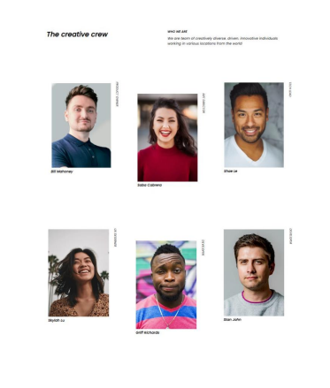

# Make It Real - NAME OF THE PROJECT

This is a solution to the My Team Page project of the Make It Real course.

## Table of contents

- [Overview](#overview)
  - [The challenge](#the-challenge)
  - [Screenshot](#screenshot)
- [My process](#my-process)
  - [Built with](#built-with)
  - [What I learned](#what-i-learned)
  - [Useful resources](#useful-resources)
- [Author](#author)


## Overview

### The challenge

Su desafío es construir una pagina responsive para mostrar a tu team y lograr que se parezca lo más posible al diseño.

Puedes usar cualquier herramienta que te guste para ayudarte a completar el desafío. Entonces, si tienes algo que te gustaría practicar, no dudes en intentarlo.

Sus usuarios deberían poder:

Ver el diseño óptimo según el tamaño de pantalla de su dispositivo

### Screenshot

Desktop design


Mobile design


## My process

### Built with

- Semantic HTML5 markup
- CSS custom properties
- Flexbox
- Mobile-first workflow

### What I learned

Use the :nth-child for a specific childs of a father container

The transform:rotate(); was used to rotate text with the employment of the people


```css
.photos_container div:nth-child(3n+2){
    align-self: flex-end;
    margin-top: 80px;
    }
.card .span{
    width: 131px;
    height: 131px;
    transform: rotate(90deg);
    align-self: flex-end;
    justify-self: end;
    position: absolute;
    bottom: 42vh;
    left: 3vh
}
```

### Useful resources

- [:nth-child()](https://developer.mozilla.org/es/docs/Web/CSS/:nth-child) - Information of CSS pseudo-class 
- [Rotate text](https://developer.mozilla.org/en-US/docs/Web/CSS/transform) - How to rotate a container

## Author

- Nicolás Rodriguez
- Sebastian Alvarez

